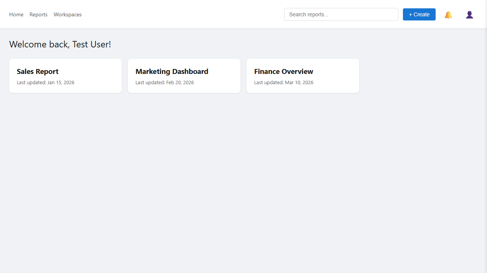

<div align="center">

# 🎭 Playwright Automation Framework

### Enterprise-grade end-to-end test automation built for scale

[](https://github.com/yousufwaqar/playwright-automation-framework/actions/workflows/quality-gate.yml)
[](https://www.typescriptlang.org/)
[](https://playwright.dev/)
 [](https://nodejs.org/)
 [](./LICENSE)
 [](#test-coverage)
 [](./CONTRIBUTING.md)
 [](https://github.com/yousufwaqar/playwright-automation-framework/commits/main)

<p>
  <a href="#why-this-framework">Why this framework?</a> |
  <a href="#quick-start">Quick start</a> |
  <a href="#test-coverage">Test coverage</a> |
  <a href="#project-architecture">Architecture</a> |
  <a href="#cicd">CI/CD</a> |
  <a href="#roadmap">Roadmap</a>
</p>
 Built by <strong><a href="https://github.com/yousufwaqar">Yousuf Waqar</a></strong><br/>
 SDET & QA Automation Lead | 11+ years of experience
 <br/><br/>

 👋 <strong>Hiring or evaluating my work?</strong> See <a href="./SKILLS.md"><strong>SKILLS.md</strong></a> — a guided tour of the
engineering skills this repo demonstrates and how to reach me.

 </div>

</div>

---

## Preview

<div align="center">

The framework drives, screenshots, and visually diffs a bundled mock BI app on every run — so the suite is fully self-contained and the visual baselines live in version control.



<sub><em>Committed visual-regression baseline (dashboard). A matching login baseline sits alongside it; the Quality Gate CI fails on any unintended pixel drift.</em></sub>

</div>

---

## Why this framework?

This repository is a production-style Playwright automation framework built to demonstrate the patterns used in scalable enterprise test automation: clean page objects, reusable fixtures, environment-driven configuration, UI + API coverage, CI-ready execution, and rich debugging artifacts.

It is designed to be easy to clone, easy to understand, and easy to extend for real-world web applications. It also ships with a **bundled mock app** so the full suite runs out-of-the-box with zero external dependencies, plus a **public demo-site test pack** (SauceDemo, The Internet, RESTful Booker) that shows the framework in action against well-known practice sites.

| What it solves             | How it helps                                                                 |
| ---                        | ---                                                                          |
| Maintainable UI automation | Page Object Model keeps selectors and page actions isolated from tests       |
| Fast feedback              | Parallel execution on Chromium in CI, with Firefox and WebKit available locally |
| Reliable CI runs           | A lightweight bundled mock app removes external system dependencies          |
| API confidence             | Contract tests validate health, auth behavior, schema, and response time     |
| Environment flexibility    | Centralized JSON config supports CI, dev, staging, and production targets    |
| Debuggability              | HTML reports, screenshots, traces, videos, and structured logs               |
| Real-world examples        | Optional external suites against SauceDemo, The Internet, and RESTful Booker |

---

## Highlights

- **Playwright + TypeScript** foundation for modern E2E automation
- **Page Object Model** with shared `BasePage` for clean separation of concerns
- **Custom fixtures** for shared page objects and structured logging
- **Data-driven testing** through JSON test data files
- **Cross-browser ready** — Chromium runs in CI; Firefox and WebKit are configured and run locally
- **Mobile viewport projects** (Pixel 7, iPhone 14) ready to enable
- **API contract validation** alongside UI coverage
- **Bundled mock application** for fully self-contained CI runs
- **Accessibility testing** with axe-core (WCAG 2.0/2.1 A & AA)
- **API & HTTP security suite** — authz, CSP & hardening headers, non-wildcard CORS, safe input handling
- **Performance smoke tests** — Navigation Timing budgets + API latency/throughput
- **Visual regression** via Playwright screenshots with platform-aware baselines
- **Docker + Docker Compose** for reproducible one-command runs
- **Composite Quality Gate CI** — every quality dimension is its own status check
- **External demo-site suites** (SauceDemo / The Internet / RESTful Booker) gated behind tags
- **GitHub Actions workflows** with Chromium runs, artifact upload, and a separate nightly external job
- **HTML, JSON, screenshot, trace, and video reporting**
- **Tag-based execution** with `@smoke`, `@regression`, `@api`, `@a11y`, `@security`, `@visual`, `@performance`, `@external`

---

## Tech stack

| Tool                                          | Purpose                                        |
| ---                                           | ---                                            |
| [Playwright](https://playwright.dev/)         | Browser automation and API testing             |
| [TypeScript](https://www.typescriptlang.org/) | Type-safe test development                     |
| [Node.js](https://nodejs.org/)                | Runtime environment (18+)                      |
| [tsx](https://github.com/privatenumber/tsx)   | Native TypeScript loader for fixtures          |
| GitHub Actions                                | CI pipeline (Chromium) and scheduled external runs |
| Playwright HTML Reporter                      | Interactive report for debugging test runs     |
| JSON test data                                | Environment and user data management           |

---

## Quick start

### Prerequisites

```bash
node --version
npm --version
```

Required:

- Node.js 18 or higher (see `.nvmrc`)
- npm 8 or higher

### Install

```bash
git clone https://github.com/yousufwaqar/playwright-automation-framework.git
cd playwright-automation-framework
npm install
npx playwright install
```

### Run the full test suite (against bundled mock app)

```bash
npm run test
```

### Run against a specific browser

```bash
npm run test:chrome
npm run test:firefox   # local only
npm run test:webkit    # local only
```

> **Note:** CI runs Chromium only. Firefox and WebKit work locally but are skipped in GitHub Actions because the Ubuntu runner image is missing required system libraries for those engines.

### Run focused suites

```bash
npm run test:smoke
npm run test:regression
npm run test:api
```

### Run individual quality modules

```bash
npm run test:a11y          # accessibility (axe-core, WCAG 2.0/2.1 A & AA)
npm run test:security      # API & HTTP security assertions
npm run test:performance   # performance smoke (Navigation Timing budgets)
npm run test:visual        # visual regression (uses committed baselines)
npm run test:visual:update # refresh visual baselines for the current platform
npm run perf:k6            # k6 API load script (requires k6 installed)
```

### Run with Docker (no local Node/Playwright needed)

```bash
docker compose up --build --exit-code-from e2e
```

This builds the pinned Playwright image, starts the mock app inside the
container, and runs the deterministic suite. See [docs/architecture.md](./docs/architecture.md).


### Run external demo-site suites (optional)

> External tests hit public practice sites (SauceDemo, The Internet, RESTful Booker). They are excluded from the default CI to keep the badge stable.

```bash
npm run test:external          # all external suites
npm run test:saucedemo         # SauceDemo only
npm run test:theinternet       # The Internet only
npm run test:api:external      # RESTful Booker API only
```

### Run in headed mode

```bash
npm run test:headed
```

### Open the HTML report

```bash
npm run report
```

---

## Run with the included mock app

The repository includes a small local mock application under `mock-app/`. This makes the framework demo-friendly because CI does not need credentials for a real external application.

The mock app is **automatically started** by Playwright using the `webServer` configuration. You don't need to start it manually. Just run:

```bash
npm run test
```

On Windows PowerShell:

```powershell
$env:BASE_URL="http://localhost:3000"; $env:TEST_ENV="ci"; $env:API_TOKEN="mock-jwt-token-12345"; npm run test
```

Mock app routes:

| Route             | Purpose                                     |
| ---               | ---                                         |
| `/login`          | Login page used by UI tests                 |
| `/dashboard`      | Dashboard page used by UI tests             |
| `/api/v1/health`  | Health endpoint used by API smoke tests     |
| `/api/v1/reports` | Reports endpoint used by API contract tests |
| `/api/login`      | Login endpoint used by the mock UI          |

---

## Test coverage

| Area                          | Coverage                                                                        |
| ---                           | ---                                                                             |
| Login UI (mock)               | Valid login, invalid login, empty field validation, page-load verification      |
| Dashboard UI (mock)           | Dashboard load, welcome message, report search, report tile interaction, logout |
| API contracts (mock)          | Health check, unauthorized access, schema validation, response-time threshold   |
| Accessibility (mock)          | axe-core WCAG 2.0/2.1 A & AA audits on login and dashboard                       |
| Security (mock API/HTTP)      | Authz enforcement, CSP & hardening headers, non-wildcard CORS, malformed-input handling, info-leak checks |
| Performance (mock)            | Navigation Timing budgets, API latency percentiles & throughput                 |
| Visual regression (mock)      | Screenshot baselines for login and dashboard (platform-aware)                   |
| SauceDemo (external)          | Login, inventory, add-to-cart, full checkout flow                               |
| The Internet (external)       | Checkboxes, dropdowns, dynamic loading, alerts                                  |
| RESTful Booker API (external) | Auth token, create / read / update / delete booking, schema validation          |
| Cross-browser                 | Chromium (CI + local), Firefox & WebKit (local)                                 |
| Mobile viewports              | Pixel 7, iPhone 14 (configured, opt-in)                                         |
| Tags                          | `@smoke`, `@regression`, `@api`, `@a11y`, `@security`, `@visual`, `@performance`, `@external`, `@saucedemo`, `@theinternet` |

---

## Project architecture

```text
playwright-automation-framework/
├── .github/
│   ├── workflows/
│   │   ├── quality-gate.yml           # Authoritative CI: composite quality gate
│   │   ├── visual-baseline.yml        # Manual: generate Linux visual baselines
│   │   └── external-ci.yml            # Nightly external demo-site suite
│   ├── ISSUE_TEMPLATE/
│   │   ├── bug_report.md
│   │   └── feature_request.md
│   ├── pull_request_template.md
│   ├── CODEOWNERS
│   └── dependabot.yml
├── docs/
│   ├── test-strategy.md               # Layers, tagging, principles
│   ├── architecture.md                # Framework structure & design decisions
│   └── quality-gates.md               # CI topology, blocking vs non-blocking
├── mock-app/
│   ├── server.js                      # Hardened mock server (headers, CORS, JSON)
│   ├── pages/
│   │   ├── login.html                 # Mock login page (no inline scripts)
│   │   └── dashboard.html             # Mock dashboard page (no inline scripts)
│   └── public/
│       ├── login.js                   # Externalised JS (strict-CSP friendly)
│       └── dashboard.js
├── performance/
│   └── k6/
│       └── api-load.js                # k6 API load script
├── src/
│   ├── fixtures/
│   │   ├── base.fixture.ts            # Custom Playwright fixtures (mock app)
│   │   └── saucedemo.fixture.ts       # Fixtures for SauceDemo external suite
│   ├── pages/
│   │   ├── BasePage.ts                # Shared page actions and assertions
│   │   ├── LoginPage.ts               # Mock login page object
│   │   ├── DashboardPage.ts           # Mock dashboard page object
│   │   └── external/
│   │       └── saucedemo/
│   │           ├── SauceLoginPage.ts
│   │           ├── SauceInventoryPage.ts
│   │           ├── SauceCartPage.ts
│   │           └── SauceCheckoutPage.ts
│   ├── utils/
│   │   ├── ConfigManager.ts           # Environment config loader
│   │   ├── Logger.ts                  # Structured logging utility
│   │   ├── TestDataManager.ts         # Test data accessor
│   │   ├── AccessibilityHelper.ts     # axe-core audit wrapper
│   │   └── PerformanceHelper.ts       # Navigation Timing + percentiles
│   └── global.d.ts                    # Ambient type declarations
├── tests/
│   ├── api/
│   │   └── api-contract.spec.ts       # Mock API contract tests
│   ├── a11y/
│   │   └── accessibility.spec.ts      # Accessibility audits
│   ├── security/
│   │   └── api-security.spec.ts       # API & HTTP security assertions
│   ├── performance/
│   │   └── perf-smoke.spec.ts         # Performance smoke tests
│   ├── visual/
│   │   ├── visual.spec.ts             # Visual regression tests
│   │   └── visual.spec.ts-snapshots/  # Committed baselines
│   ├── external/
│   │   ├── saucedemo/
│   │   │   ├── login.spec.ts
│   │   │   └── checkout.spec.ts
│   │   ├── the-internet/
│   │   │   └── ui-elements.spec.ts
│   │   └── api/
│   │       └── restful-booker.spec.ts
│   ├── test-data/
│   │   ├── environments.json          # CI/dev/staging/prod config
│   │   ├── users.json                 # Test users
│   │   └── external-sites.json        # Credentials/URLs for demo sites
│   ├── dashboard.spec.ts              # Dashboard UI tests
│   └── login.spec.ts                  # Login UI tests
├── Dockerfile                         # Pinned Playwright image
├── docker-compose.yml                 # One-command containerised run
├── .dockerignore
├── .nvmrc                             # Pinned Node version
├── CONTRIBUTING.md
├── playwright.config.ts               # Playwright configuration
├── package.json                       # Scripts and dependencies
├── tsconfig.json                      # TypeScript configuration
└── README.md
```

---

## Design patterns

### Page Object Model

Page classes own page-specific locators, interactions, and assertions. Tests call clear business-level actions instead of repeating selector logic.

```typescript
await loginPage.goto();
await loginPage.login(user.username, user.password);
await loginPage.assertLoginSuccess();
```

### Custom fixtures

The framework extends Playwright fixtures to provide ready-to-use page objects and logging in every test.

```typescript
test("should login successfully", async ({ loginPage, logger }) => {
  logger.step(1, "Navigate and login");
  await loginPage.goto();
});
```

### Configuration management

`ConfigManager` loads environment-specific settings from:

```text
tests/test-data/environments.json
```

This supports clean switching between `ci`, `dev`, `staging`, and `production` through:

```bash
TEST_ENV=ci
```

---

## Reporting and debugging

The framework is configured to generate:

| Artifact     | Purpose                      |
| ---          | ---                          |
| HTML report  | Interactive test report      |
| JSON results | Machine-readable test output |
| Screenshots  | Captured on failure          |
| Traces       | Captured on first retry      |
| Videos       | Captured on first retry      |
| Logs         | Step-level execution details |

Open the report after a run:

```bash
npm run report
```

---

## CI/CD

CI is a **composite Quality Gate**: every quality dimension runs as its own job
and produces an independent status check. Full details in
[docs/quality-gates.md](./docs/quality-gates.md).

### `quality-gate.yml` — authoritative workflow

Runs on push to `main`/`develop`, pull requests targeting `main`, and a daily
schedule. Test jobs run inside `mcr.microsoft.com/playwright:v1.59.1-jammy`, so
browsers are preinstalled.

**Blocking** (gate the merge): `lint-typecheck`, `functional`, `accessibility`,
`security`. These are aggregated by a final `quality-gate` job via `needs`.

**Non-blocking** (`continue-on-error: true`, informational): `performance`,
`visual`, `k6-load`. A red performance/visual run stays visible without blocking
a merge.

> Branch protection should require the **Quality Gate** status check (the older
> "Playwright Tests" check was removed with `playwright-ci.yml`).

### `visual-baseline.yml` — Linux baselines

Playwright screenshot baselines are platform-specific. Windows baselines are
committed for local dev; run this `workflow_dispatch` once to generate and commit
the Linux baselines so the CI `visual` job goes green.

### `external-ci.yml` — nightly external workflow

Runs the SauceDemo, The Internet, and RESTful Booker suites on a nightly schedule
and on manual dispatch only. Failures here do not affect the main badge.

---

## Available scripts

| Command                     | Description                           |
| ---                         | ---                                   |
| `npm run test`              | Run deterministic suite (excludes external, visual, performance) |
| `npm run test:functional`   | Functional + API only (excludes a11y/security/visual/perf) |
| `npm run test:quality`      | Run all non-external tests (every quality module) |
| `npm run test:headed`       | Run tests with visible browser        |
| `npm run test:chrome`       | Run Chromium project                  |
| `npm run test:firefox`      | Run Firefox project (local only)      |
| `npm run test:webkit`       | Run WebKit project (local only)       |
| `npm run test:api`          | Run mock API contract tests           |
| `npm run test:smoke`        | Run smoke tests                       |
| `npm run test:regression`   | Run regression tests                  |
| `npm run test:a11y`         | Run accessibility audits              |
| `npm run test:security`     | Run API & HTTP security tests         |
| `npm run test:performance`  | Run performance smoke tests           |
| `npm run test:visual`       | Run visual regression tests           |
| `npm run test:visual:update`| Refresh visual baselines (current platform) |
| `npm run perf:k6`           | Run k6 API load script (requires k6)  |
| `npm run typecheck`         | Type-check without emitting           |
| `npm run test:external`     | Run all external demo-site suites     |
| `npm run test:saucedemo`    | Run SauceDemo external suite          |
| `npm run test:theinternet`  | Run The Internet external suite       |
| `npm run test:api:external` | Run RESTful Booker external API suite |
| `npm run report`            | Open Playwright HTML report           |

---

## Roadmap

Recently delivered:

- ✅ Accessibility testing with axe-core
- ✅ API & HTTP security suite
- ✅ Performance smoke tests + k6 load script
- ✅ Visual regression testing
- ✅ Docker support for consistent local execution
- ✅ Composite Quality Gate CI with per-module status checks

Planned:

- Add Allure reporting integration
- Publish Playwright HTML reports to GitHub Pages
- Promote the visual job to blocking once Linux baselines are seeded
- Add reusable GitHub Actions workflow templates

---

## Recommended repository topics

Add these topics in GitHub so the project is easier to discover:

```text
playwright
typescript
test-automation
e2e-testing
api-testing
page-object-model
github-actions
qa-automation
ci-cd
sdet
```

---

## Contributing

Contributions are welcome. See [CONTRIBUTING.md](./CONTRIBUTING.md) for the full guide.

1. Fork the repository
2. Create a feature branch
3. Commit your changes
4. Push your branch
5. Open a pull request

Recommended branch naming:

```bash
git checkout -b feat/add-new-test-suite
```

Recommended commit style:

```bash
git commit -m "feat: add dashboard filter tests"
```

---

## License

This project is licensed under the MIT License. See [LICENSE](./LICENSE) for details.

---

<div align="center">

### If this framework helps you, consider giving it a star.

Built with Playwright, TypeScript, and a quality-first automation mindset.

</div>

